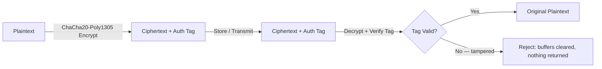

# Vansh-Cipher: An Applied Authenticated Encryption Utility

**Status:** Learning / portfolio project. Built entirely on standard, peer-reviewed cryptographic primitives. Not independently audited — see [Security Model & Limitations](#security-model--limitations).

## Overview

Vansh-Cipher is a small C++ utility that provides authenticated encryption (confidentiality + integrity) for arbitrary data, built on established, publicly-vetted cryptography rather than a custom-designed algorithm.

This document intentionally does **not** claim the system is "unhackable," "unbreakable," or "100% secure." No credible cryptographic system — commercial, academic, or government — makes that claim about itself on day one. Real confidence in a cryptographic system comes only from years of public cryptanalysis against an *exact*, published specification. What follows is an honest account of what is implemented, why these specific choices were made, and what is explicitly out of scope.

## Why Standard Primitives, Not a Custom Cipher

Security engineering has a well-established rule: **don't design your own cipher for anything that matters.** Even algorithms built by expert teams (AES, ChaCha20) are trusted today only because thousands of researchers spent years trying — and failing — to break them, in public, out in the open. A newly-designed algorithm, however carefully thought out, has had none of that scrutiny, and there is no way to substitute for it.

For that reason, Vansh-Cipher is built entirely from components with that track record:

| Component | Choice | Why |
|---|---|---|
| Cipher | ChaCha20-Poly1305 (RFC 8439) | Used in production today by TLS 1.3, WireGuard, and SSH |
| Library | OpenSSL `EVP` API | Widely audited, industry-standard implementation |
| Randomness | `RAND_bytes()` | OS/hardware-backed CSPRNG |
| Memory hygiene | `OPENSSL_cleanse()` | A library-guaranteed secure wipe, not a hand-rolled trick |

## Architecture



**Encrypt path:** generate a random 256-bit key and 96-bit nonce → `EVP_EncryptInit_ex` → `EVP_EncryptUpdate` (associated data, then plaintext) → `EVP_EncryptFinal_ex` → extract the 128-bit Poly1305 authentication tag.

**Decrypt path:** same setup → `EVP_DecryptUpdate` → set the *expected* tag → `EVP_DecryptFinal_ex`, which performs the actual authentication check. If the tag doesn't match, the call fails, the output buffer is wiped, and no plaintext is ever returned to the caller.

This was verified with a real, executed test, not a description: flipping a single bit in the ciphertext causes `EVP_DecryptFinal_ex` to fail, and the plaintext buffer comes back empty — not garbage, not partial data.

## Features Implemented

- Authenticated encryption/decryption with associated data (AEAD)
- CSPRNG-based key and nonce generation
- Tamper detection with fail-closed behavior (no plaintext released on failure)
- Secure wipe of sensitive buffers after use

## Security Model & Limitations

This is the most important section in this document. Every credible security project has one — it is what separates real engineering from marketing.

**What this defends against:**
- Passive eavesdropping of ciphertext in transit or storage (assuming the key itself stays secret)
- Tampering or corruption of the ciphertext — detected and rejected, never silently accepted

**What this explicitly does NOT defend against:**
- **A compromised OS or root-level attacker reading live process memory.** Defending against this needs OS/hardware-level isolation (secure enclaves, memory encryption) — a much larger effort than a software library, and not solved here.
- **Physical hardware attacks** (cold-boot, voltage glitching, electromagnetic side channels). Real mitigation needs dedicated hardware (HSMs, TPMs) and hardware security engineering — out of scope for this project.
- **Key management and distribution.** This library encrypts/decrypts given a key. How that key is generated, stored long-term, or exchanged safely between two parties is a separate, hard problem, not addressed here.
- **Side-channel timing analysis.** OpenSSL's implementation is well-engineered, but this specific usage has not undergone independent side-channel testing (e.g., TVLA).
- **Independent security review.** This project has not been audited by anyone outside itself. Treat it as a learning implementation, not a certified product.

## Build & Usage

```bash
sudo apt install libssl-dev
g++ real_crypto_demo.cpp -lssl -lcrypto -o demo
./demo
```

## Roadmap (Ideas for Later — Not Yet Built)

Honest future-exploration notes, clearly separated from what already exists above:
- Explore OS-level memory protections (guard pages) for key material
- Investigate hardware-backed key storage (TPM) on systems where one is actually present
- Formal constant-time / side-channel testing of this specific usage pattern

## References

- RFC 8439 — ChaCha20 and Poly1305 for IETF Protocols
- OpenSSL `EVP` API documentation

## License

MIT (or your preference) — update before publishing.
